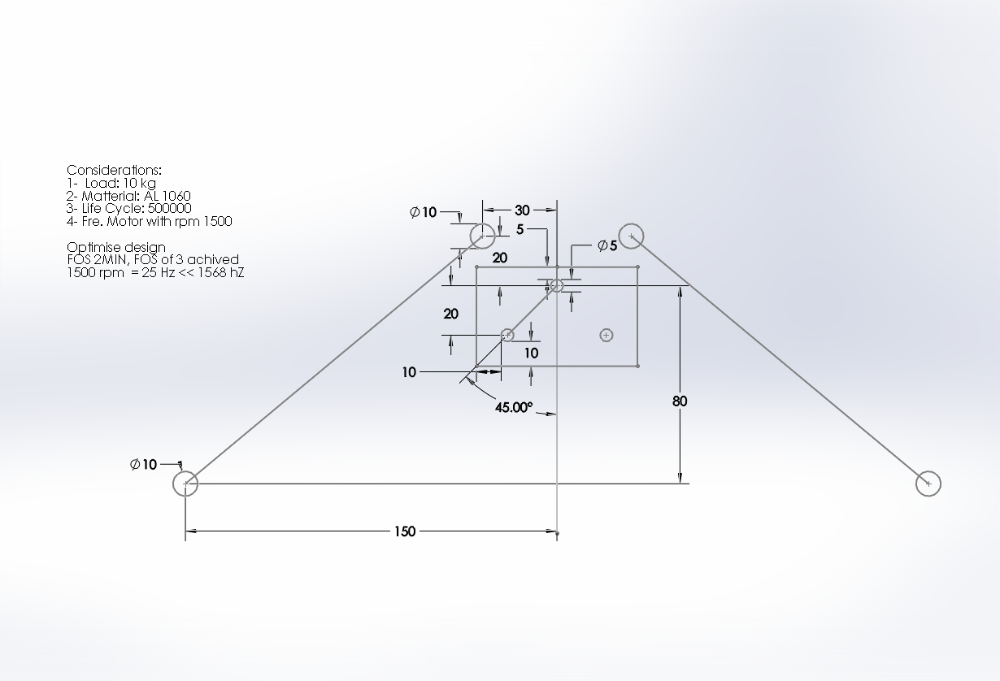
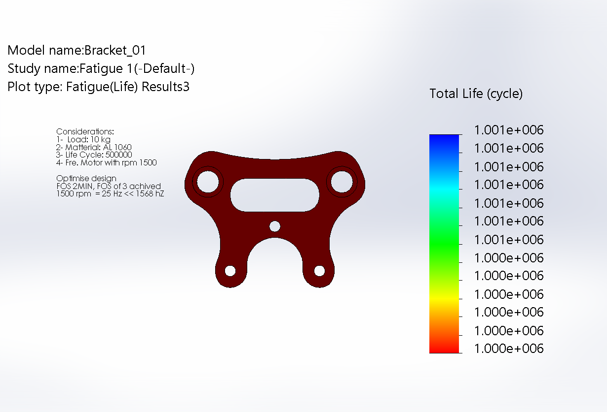
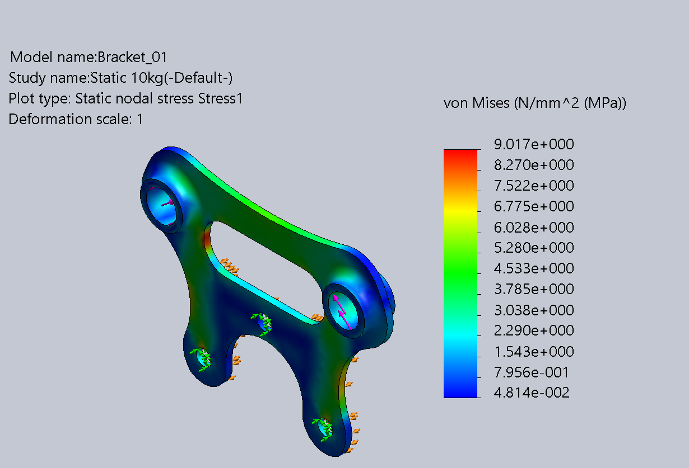
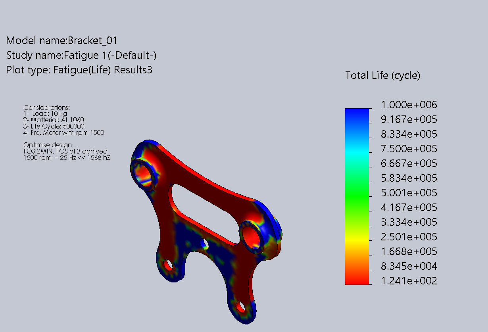
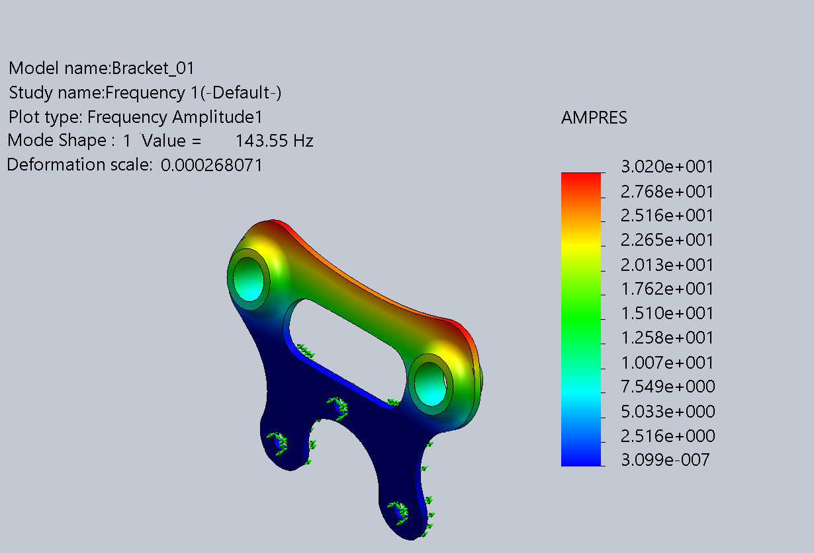
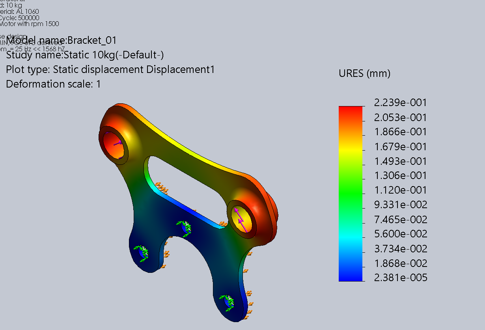

# Ehsan Tabatabaie | Engineering Portfolio

## A Bracket for a Toy car

This page demonstrates the steps taken to design a bracket for a toy car. The bracket connects two springs to the wheels, providing necessary suspension flexibility.

## Design Considerations
The goal was to develop an efficient design that minimizes weight and cost while maintaining high structural integrity. Since there are no specific aesthetic requirements from the customer, the focus is entirely on performance and material optimization.

* **Load:** Each spring applies a maximum load of 10 kgf.
* **Factor of Safety (FOS):** A minimum FOS of 2 must be maintained.
* **Material:** AL-Alloy 1060.
* **Operating Conditions:** Electric motor with a maximum RPM of 1500.
* **Warranty:** Two-month standard warranty.

---

## Iterative Design Process

### 1. Initial Concept and FEA Baseline
Initially, an outline was created based on the connection points and the orientation of the car's springs. The basic raw design began as a rectangular block with a thickness of 10 mm.

| Initial Design View | FEA Simulation Result |
| :---: | :---: |
|| |

Regardless of the yield point status, the stress distribution highlights the specific areas of the plate that endure the most load.

### 2. Geometry Optimization
By identifying the stress paths, I updated the design to remove material from "dead zones" (areas with no stress participation) and reinforced the high-contribution areas. 
Since the initial design was over-engineered (FOS ~30), I reduced the thickness to 5 mm to save weight.

| Area of the initial bracket that take the stress  | Implementing the design updated using stress distribution diagram | 
| :---: | :---: |
|| |

| Resultant Bracket and reducing the thickness to 5 mm reducing the weight  | FEA results for the factor of safety | 
| :---: | :---: |
|| |

### 3. Next Refinement and Stress Concentration
The next step involved further removing low-participation material. FEA results for this iteration showed that thickness could be safely reduced to 3 mm while staying within acceptable endurance ranges.
On the left side result of stress distribution for the new design demonstrated the area that can be removed withing an acceptable endurance range. To accommodate the spring connections, I implemented bushings to preserve local thickness and added guiding pins for the springs. Note how the stress concentration shifts as the geometry becomes more refined. 

| FEA Stress result of 1st improvement | FEA results for the improved version | 
| :---: | :---: |
|| |

The left side figure demonstrate the area of the design that endure stress value above the 10 times yield strenght. the right side figure demonstrate the improved version boundign the stress to about FOS of 10 (8.9).

| FEA Stress result  | FEA results for the improved version | 
| :---: | :---: |
|| |

### 3. Final Refinement and Stress Concentration

Reducing the thickness of the material from 3mm to 2mm improve weight lost in the materal by anout 30%. Further weight lost achived by moving the area between the two spring connector. On the right side the updated version with FOS of 3 achived. 
| FEA Stress result to 2 mm | FEA results for the improved version | 
| :---: | :---: |
|| |

## Final Analysis Results using Aluminum
* Checking the natural frequency of the part, the first natural frequency is around 1500 HZ which is much higher that 1500rpm.
* On the right side the life expectancy of the part is reported for 1000000 maximume impact (assuming charging time 4 hours of operation, speed of 1m/s, 1 full impact per meter) privdes us with 66 days of warranty. The simulation can go higher with other senarios. 
 
| Natural frequency analysis | Fatigue FEA results | 
| :---: | :---: |
|||
| An alternative design can be achived by taking another look at the stress distribution here improve the area with green color and even removing the joint at the central part | 

## Alternative considerations
If the manufacturer want to go with a materila with lower cost using High Density Polyethylene can be a good alternative with [Yield Strength (8 MPa), Ultimate Tensile Strength (15 MPa), and Compressive Strength (20 MPa)](https://www.engineercalculator.com/polymer-plastic-properties-and-overview/pe-polymer-plastic-various-properties-and-overview/). 

Simulation resuslts for HDPE. The simulations shows while the from frequency perspective the part is in good hand, it has much lower life expectancy from fatigue is it goes throught the scenario considered earlier. Perhapt this version is more suitable for flat street road game play. 
| |  | 
| :---: | :---: |
| |  | 

