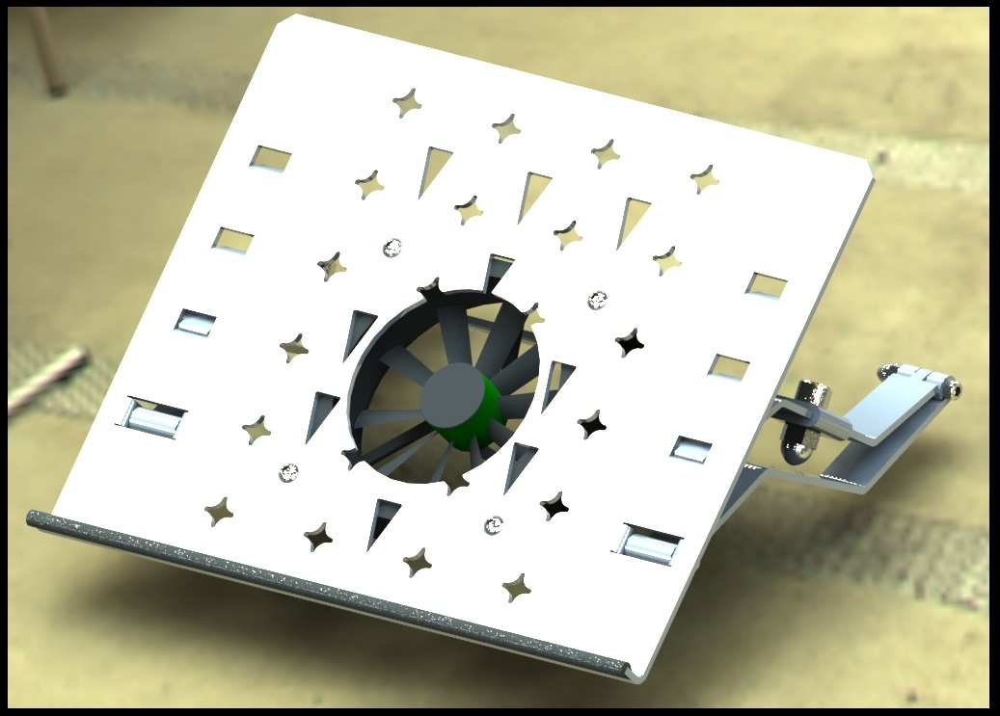
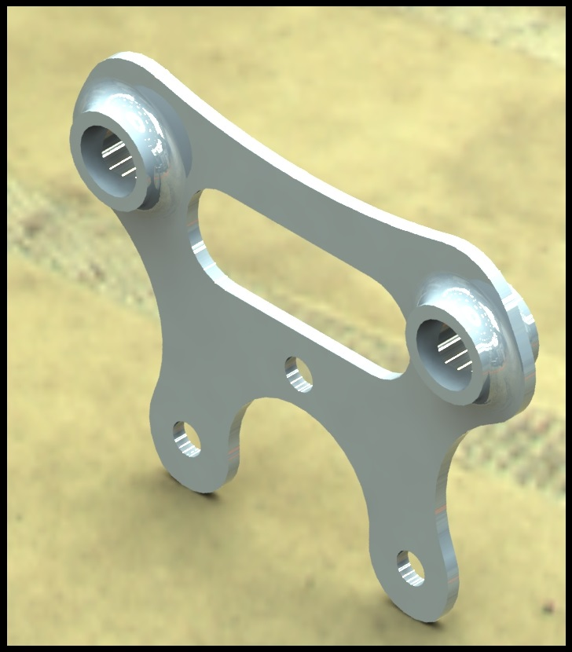
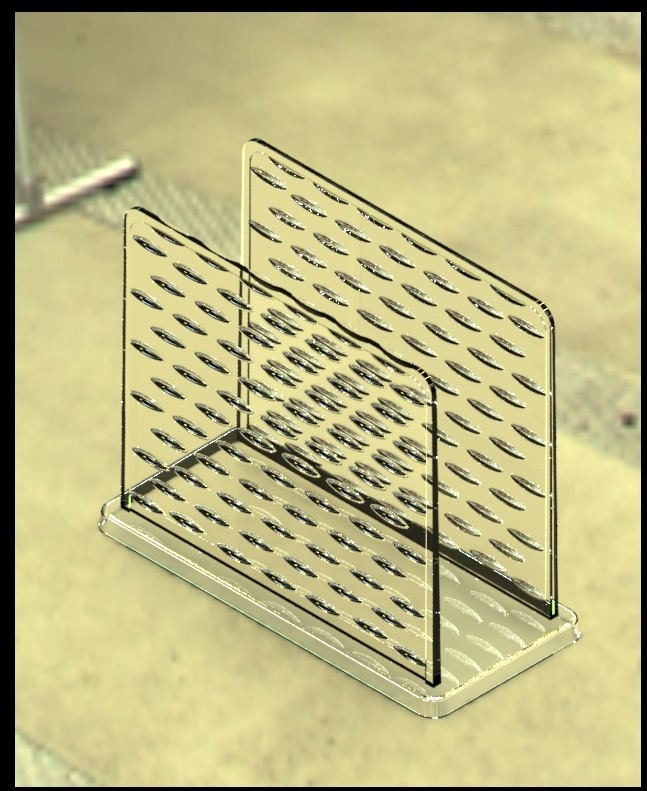
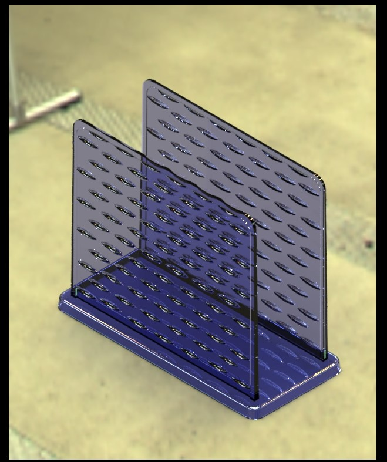
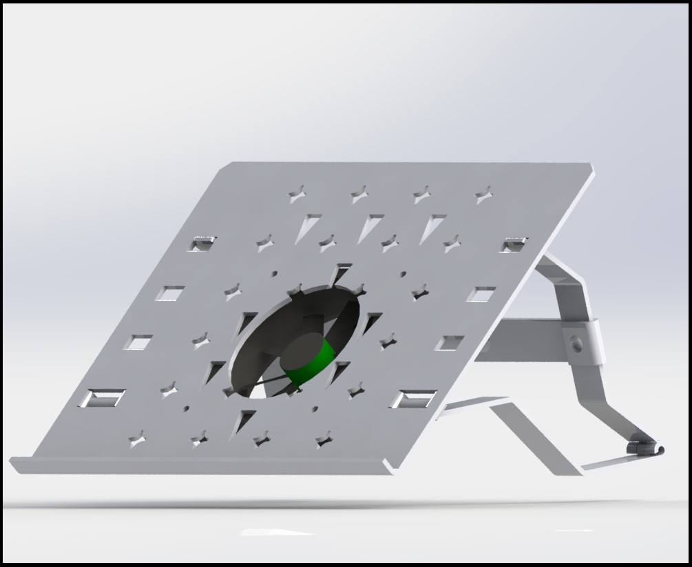
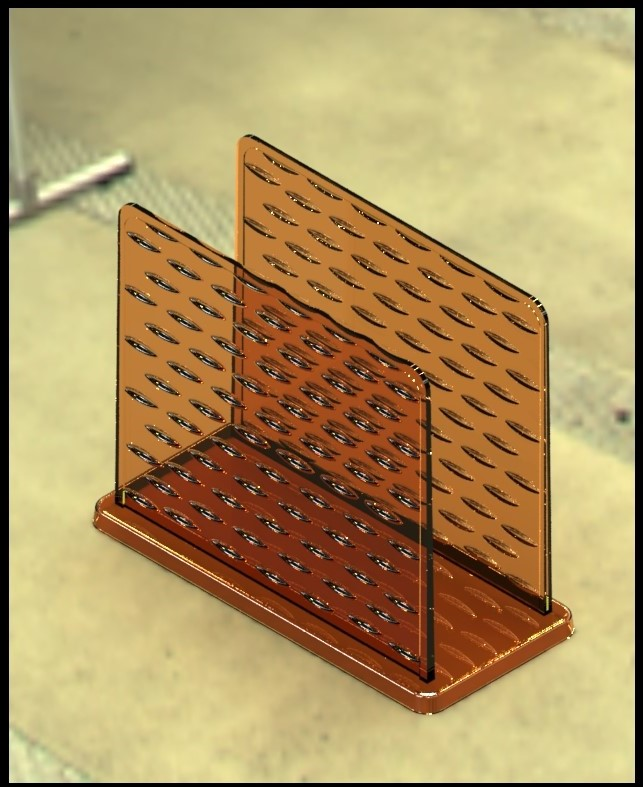
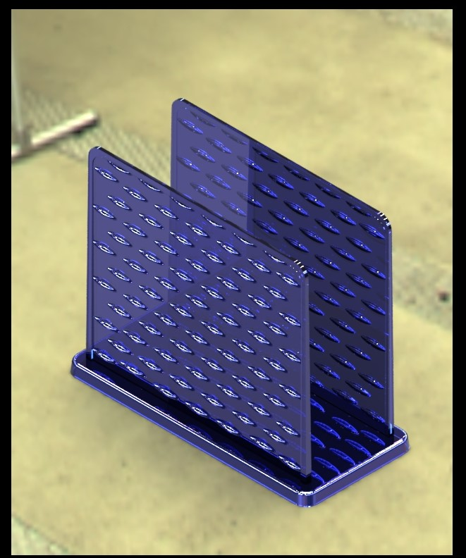

# Ehsan Tabatabaie | Engineering Portfolio
# Initial Steps in designing a thermoform tool for a cake container

## 1. Project Overview
This page contains the process I tok to initiate CAD design in tooling for a thermo forming part. The goal was to create step to creat a parametric model for this tool.
So faar the process containe creation of initial step for one side of thecontainer.

## 2. Materials

| Material | Mechanical Strength | Cost | Recyclability | Food Safety | Transparency | Chemical Resistance | Popularity in Food Industry |
| :---: | :---: | :---: | :---: | :---: | :---: | :---: | :---: |
| Polypropylene (PP) | High | Low to Moderate | Widely recyclable (recycling code #5) | Excellent (FDA approved) | Opaque to translucent | Good (resistant to acids, bases) | Very High |
| Polyethylene Terephthalate (PET) | Moderate to High | Moderate | Widely recyclable (recycling code #1)| Excellent (FDA approved) | High (clear) | Moderate (sensitive to strong bases) | High |
| High-Impact Polystyrene (HIPS) | Moderate | Low | Limited recyclability (recycling code #6) | Good (FDA approved) | High (clear) | Moderate (sensitive to solvents) | Moderate |
| Polyethylene (PE) | Moderate | Low | Widely recyclable (recycling codes #2, #4) | Excellent (FDA approved) | Opaque to translucent | Good (resistant to moisture, chemicals) | High |
| Polylactic Acid (PLA) / CPLA | Moderate to Low | Moderate to High | Compostable, limited recycling | Good (FDA approved) | High (clear) | Moderate (sensitive to heat and moisture) | Growing (eco-friendly trend) |

| |  |
					
							
Explanation of Terms:
* **Mechanical Strength**: Ability to withstand physical stress without deformation or breaking.
* **Cost**: Relative cost for mass production (Low, Moderate, High).
* **Recyclability**: Availability and ease of recycling or composting.
* **Food Safety**: Compliance with food contact regulations (FDA or equivalent).
* **Transparency**: Clarity level for product visibility.
* **Chemical Resistance**: Resistance to acids, bases, solvents, and moisture.
* **Popularity**: Common usage level in the food packaging industry.

## 2. Design Visuals
Below are the rendering of the model.

  

  
  

  
  

