# Ehsan Tabatabaie | Engineering Portfolio

## A Bracket for a Toy car

In this page I am demonstrating the steps I took to design a bracket of toy car.

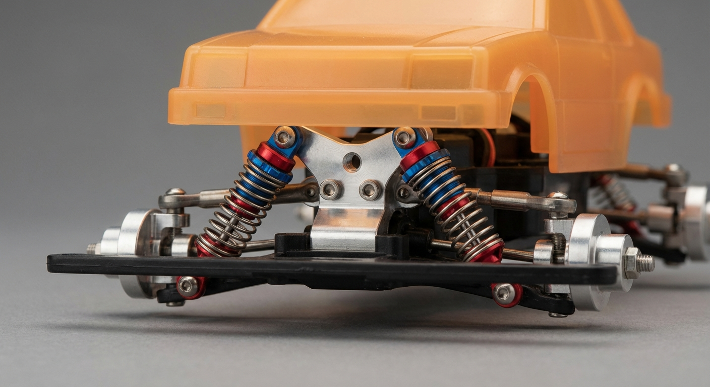

## Design considerations
- Each spring will apply load of 10kgf at most
- Minimume Factor of Safety 2
- Materila: AL-Alloy 1060
- Electric motor has the MAX RPM 1500

## Design considerations

The goal was to creat the most effective design approache. Since there is no aesthetic consideration form customer. 

| Initial Desing with thickness of 10 mm  | FEA simulation result | 
| :---: | :---: |
|| 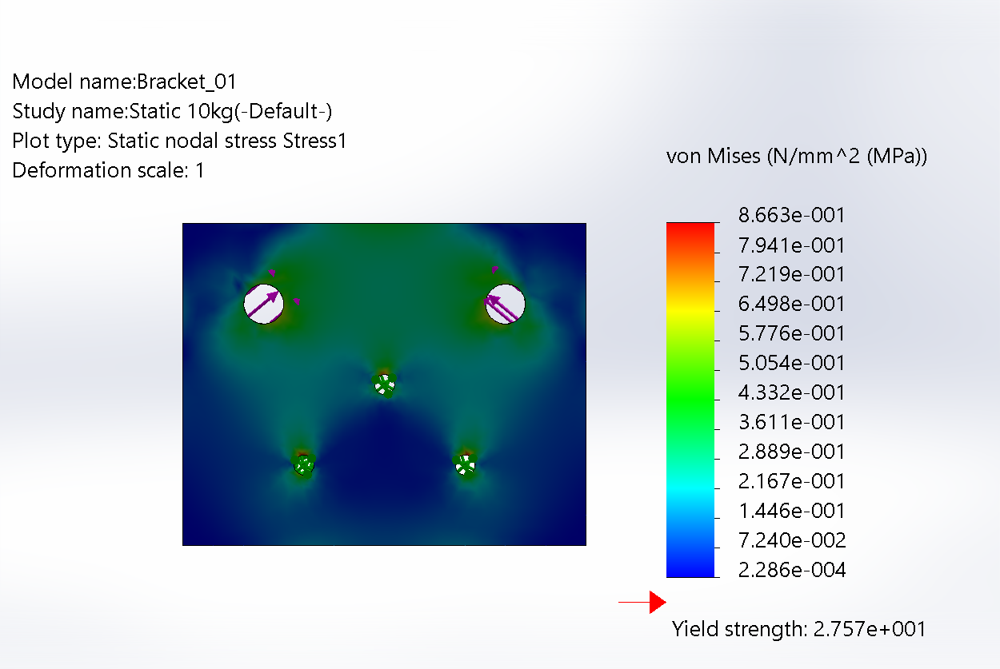|

The stress distribution shows the area of the plate with higher stress leve regardless of the statuse of passing the Yield point.

| Area of the bracket that endur stress  | Implementing the design using stress distribution diagram | 
| :---: | :---: |
|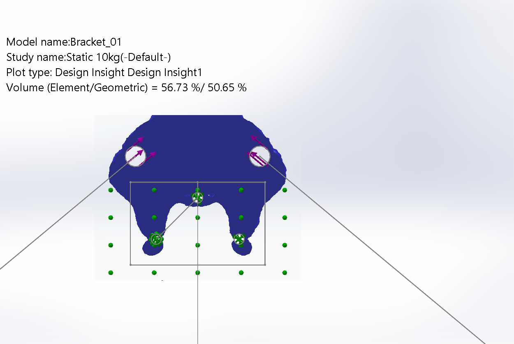| 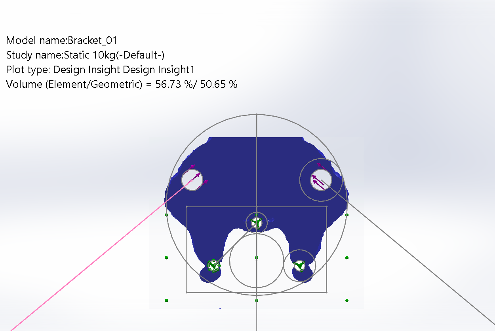|

| Resultant Bracket and reducing the thickness to 5 mm reducing the weight  | FEA results for the factor of safety | 
| :---: | :---: |
|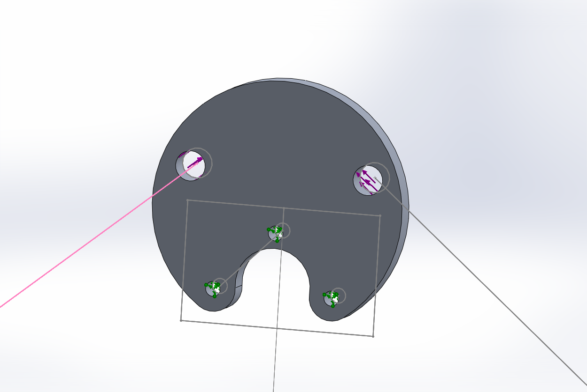| 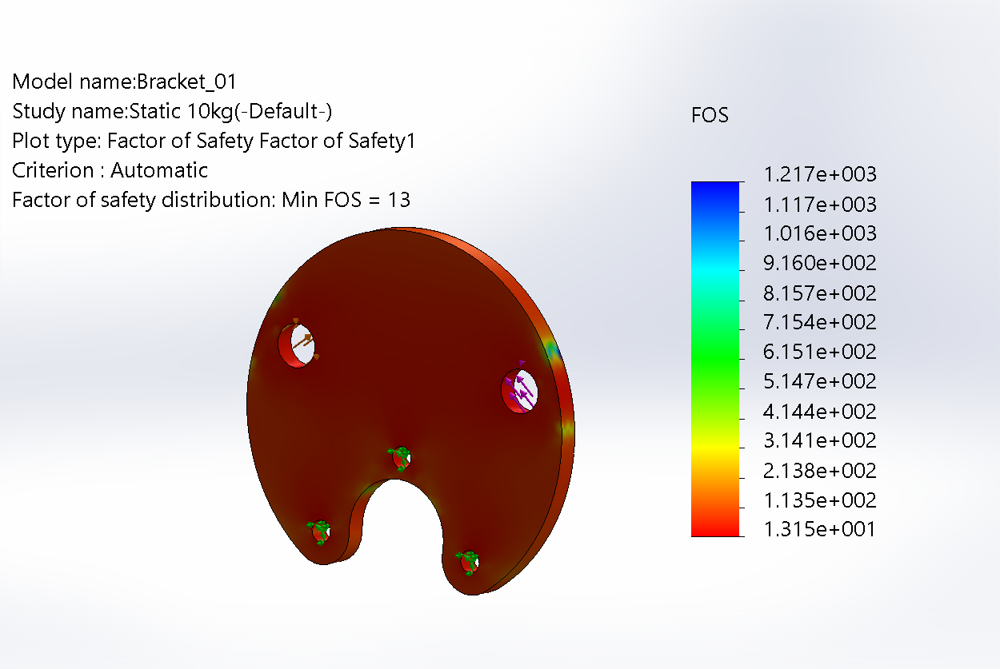|

| FEA Stress result  | FEA results for the improved version | 
| :---: | :---: |
|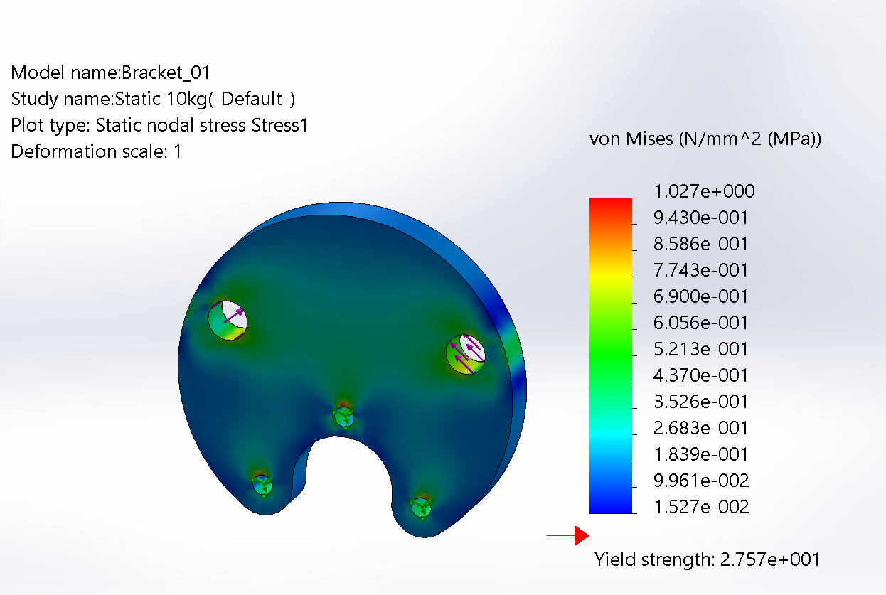| 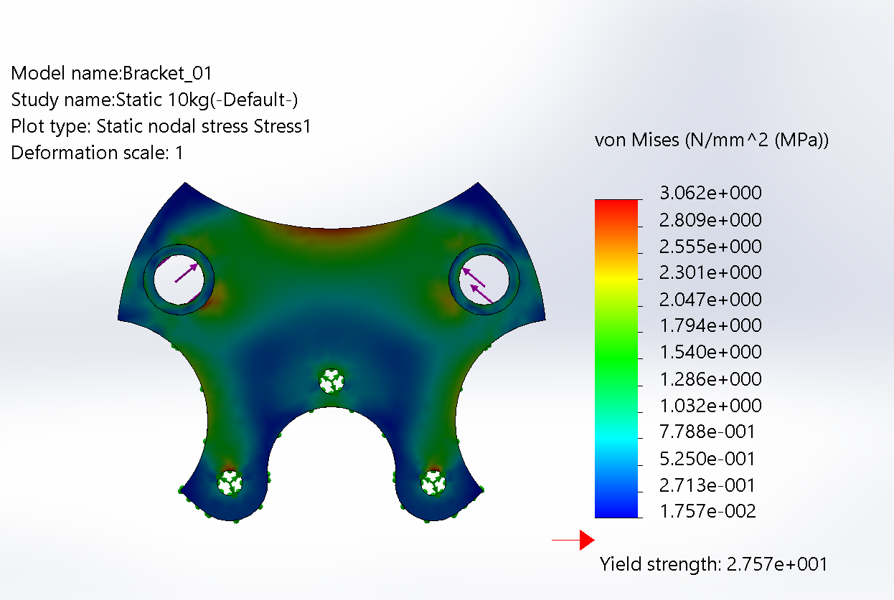|

| FEA Stress result  | FEA results for the improved version | 
| :---: | :---: |
|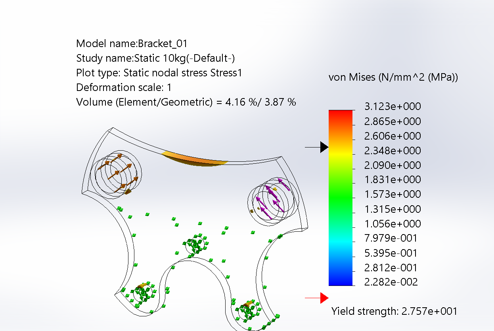| 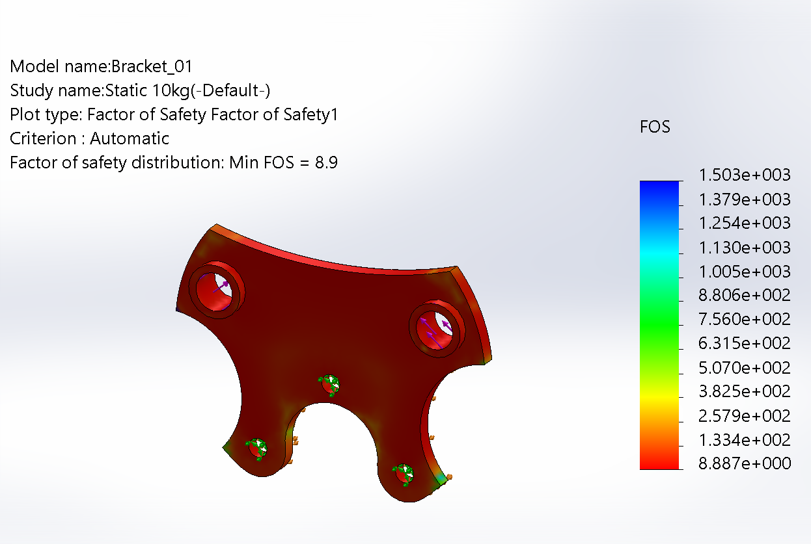|

| FEA Stress result to 2 mm | FEA results for the improved version | 
| :---: | :---: |
|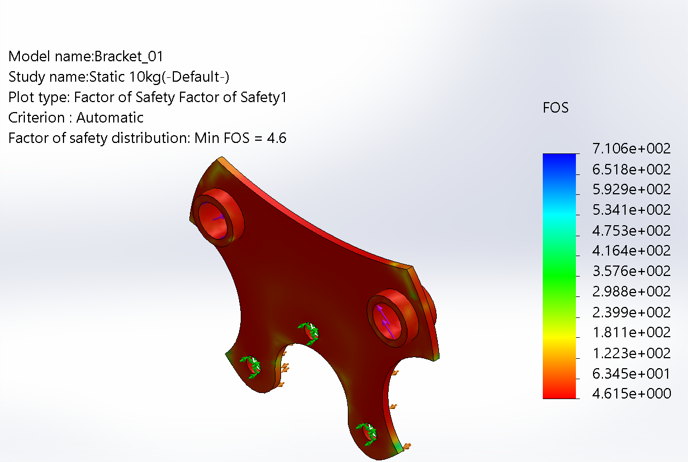| 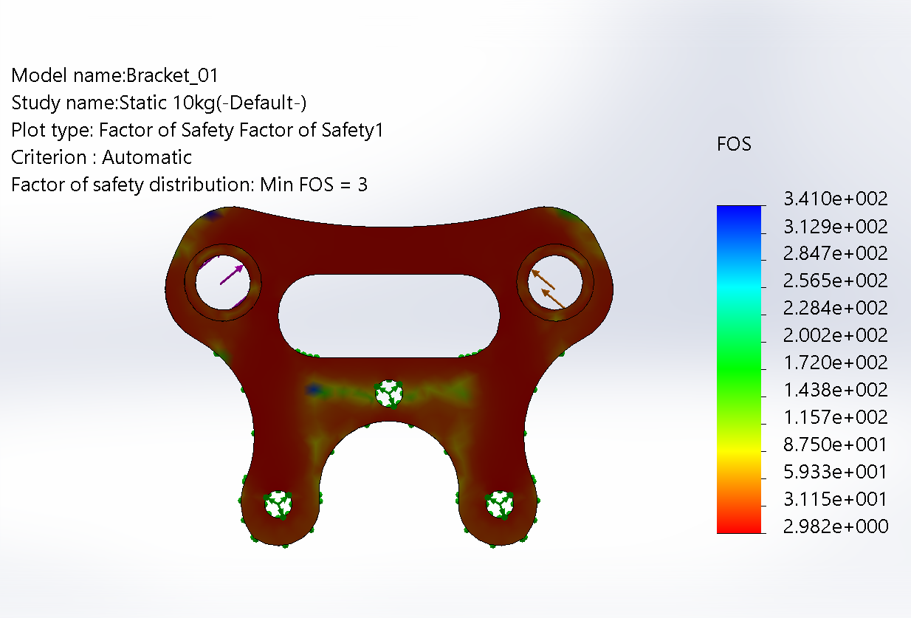|

Final version 
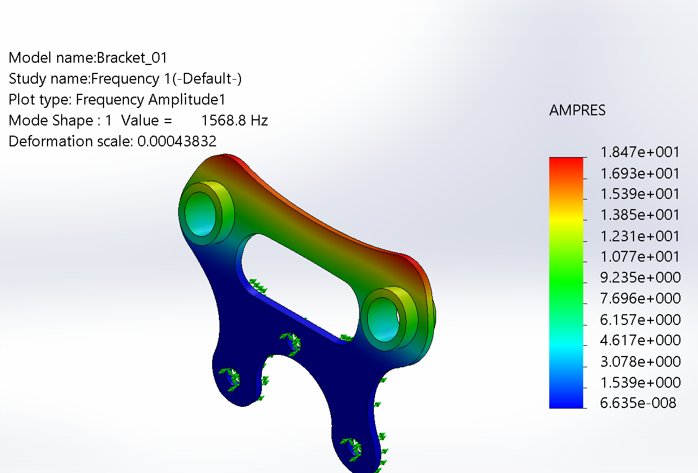

