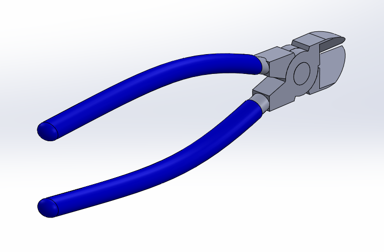
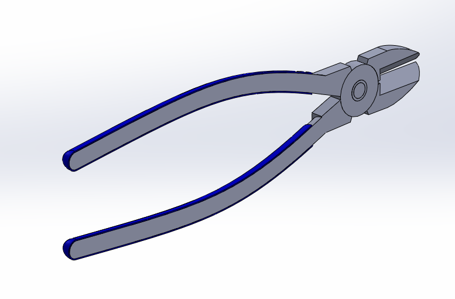
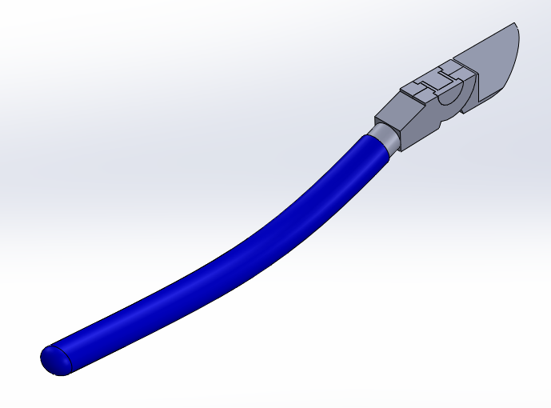
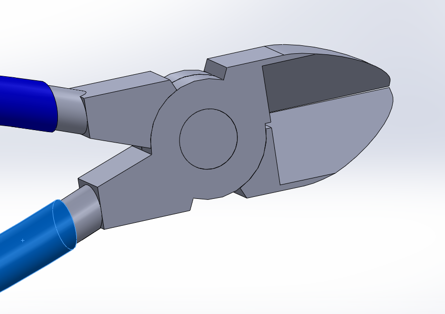
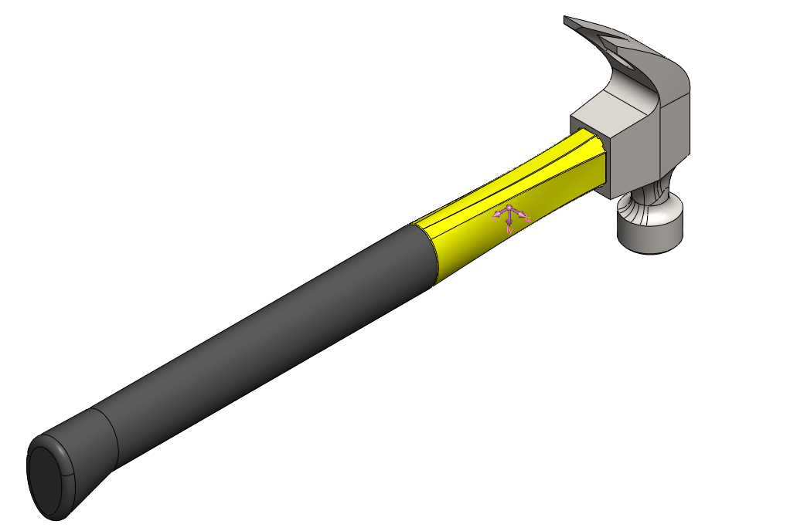
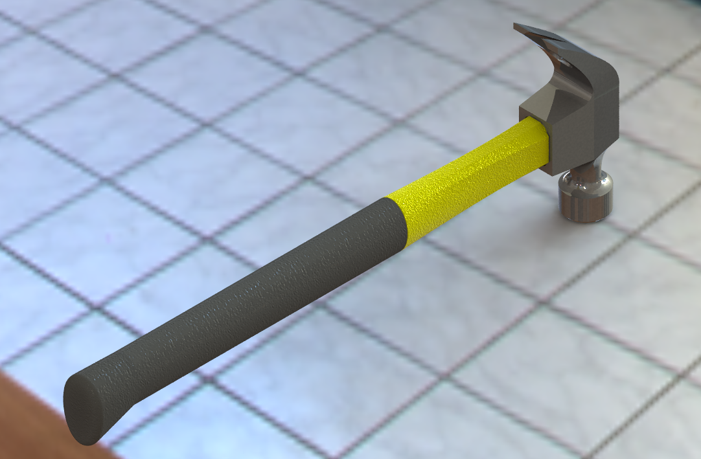

# EhsanTabatabaie.github.io
# Hammer Design & Analysis Project

## 1. Project Overview
This file contains the CAD design and Finite Element Analysis (FEA) for a Claw Hammer. The goal was to design a real size hammer with proper material assignment for the hammer while maintaining structural integrity.

## 2. Design Visuals
Below are the screenshots of the 3D model.

### CAD Model

Final design of the model as a single part. The model consists of there parts with different materila and color assignment. The naterials are AISI 4140 Alloy Steel for the head and Fiberglass for the handle with a rubber cover at the end.

This section view demonstrate the depth of the handle into the rubbber part and its interaction with the head of the hammer.

| Head of the hammer  |  Head of the hammer from another angle |
| :---: | :---: |
|  |  |

| Head of the hammer  |  Head of the hammer from another angle |
| :---: | :---: |
|  |   |

## 3. Mass Properties & Material Assignment
To optimize the swing-weight of the hammer, materials were assigned to shift the **Center of Mass** toward the striking head:
* **Head:** AISI 4140 Alloy Steel (High Density/Strength)
* **Handle:** Fiberglass (Lightweight/Durable)
* **Grip:** Rubber (Ergonomic Shock Absorption)
### FEA Simulation Results
> **Note:** These images show the stress distribution under a load of [Insert Load, e.g., 500N].
