# Ehsan Tabatabaie | Engineering Portfolio
# A holder for phone and Camera presentation

## 1. Project Overview
This file contains the CAD design rendering and 2D drawing for **Phone/Camera Holder**.

## 2. Design Visuals
Below are the **renderings** of the model.
The one for the Camera Has an error. the grip is not needed.

  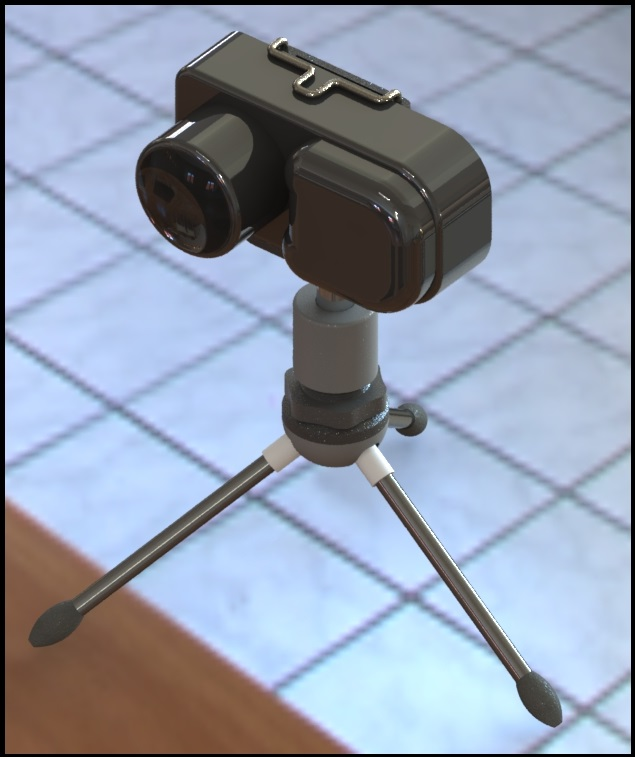
  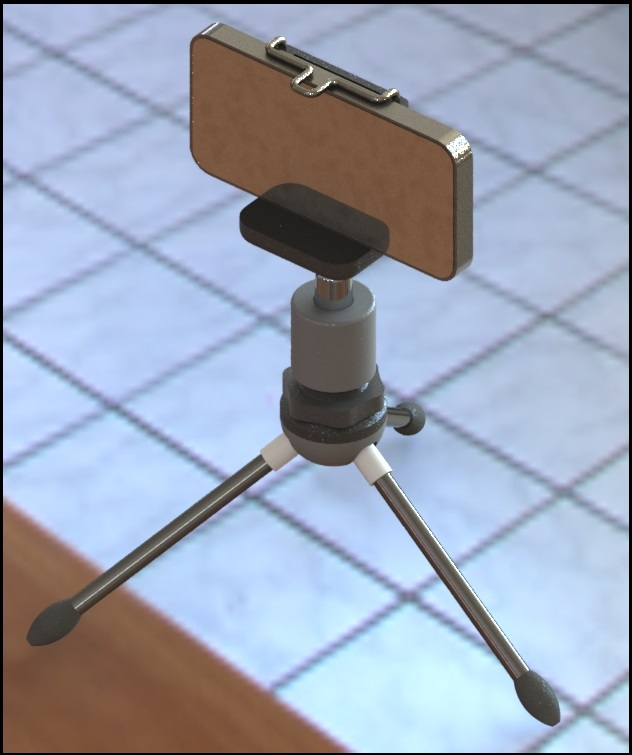

  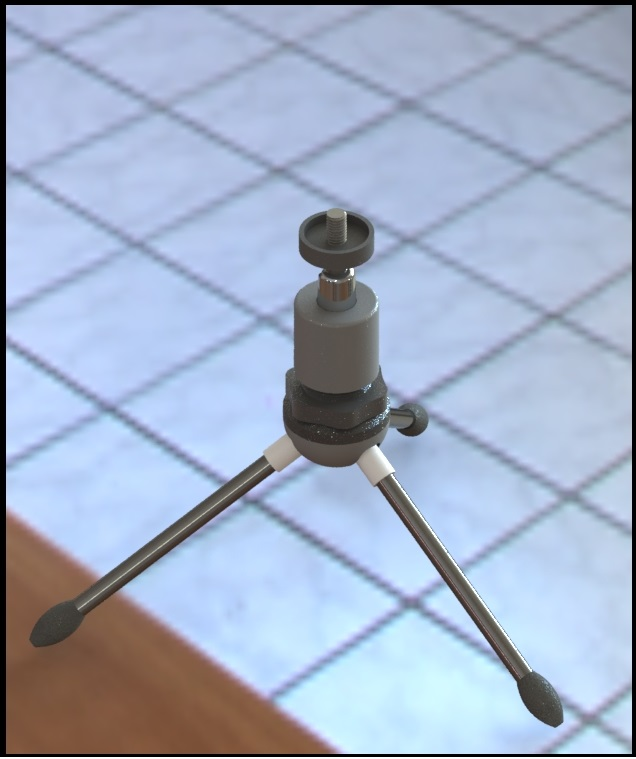
  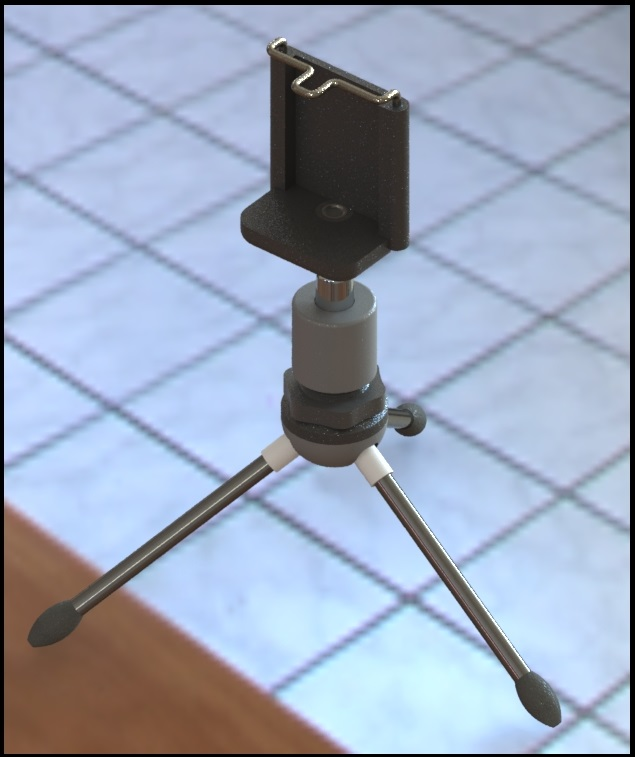

  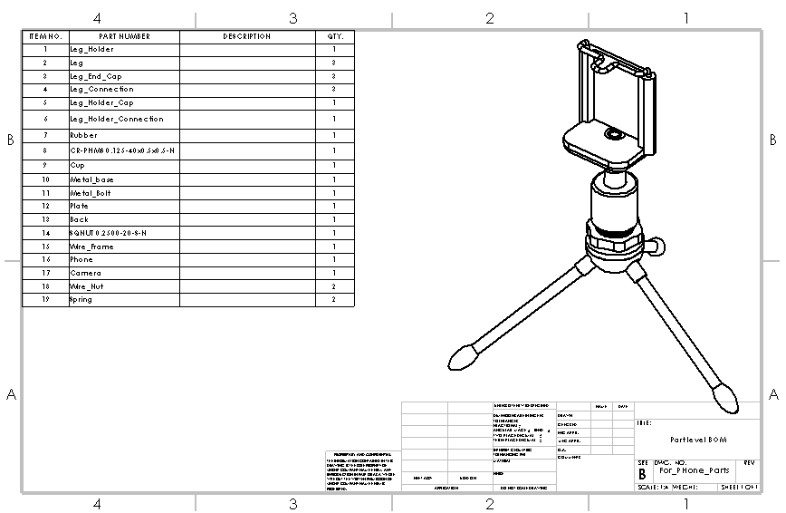

  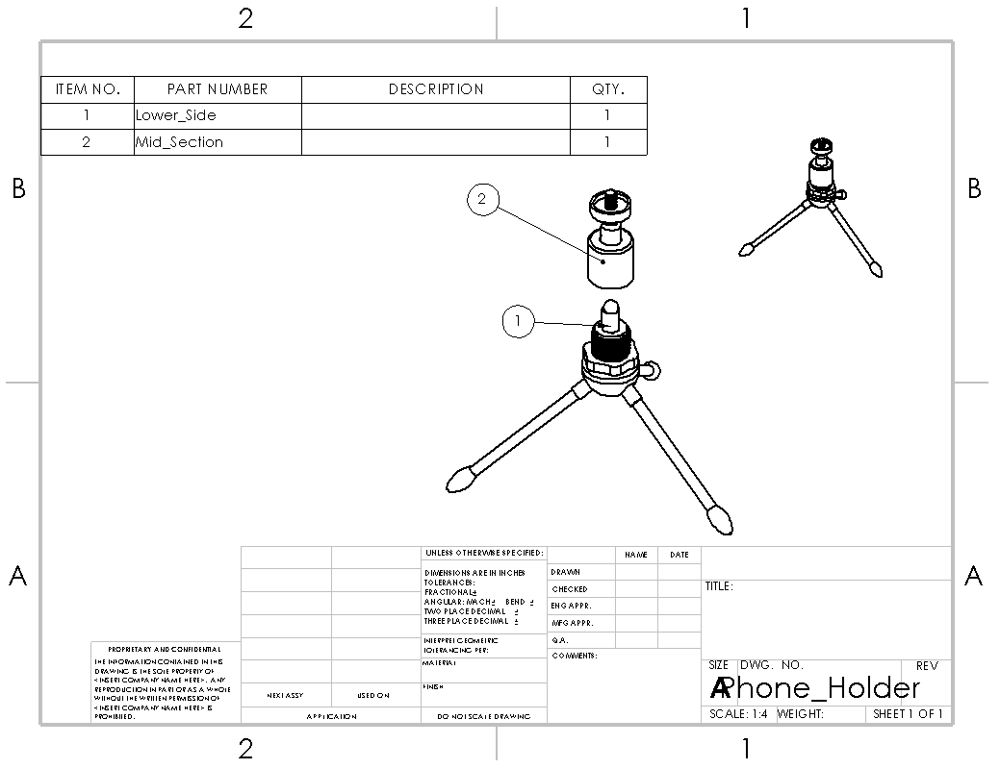
  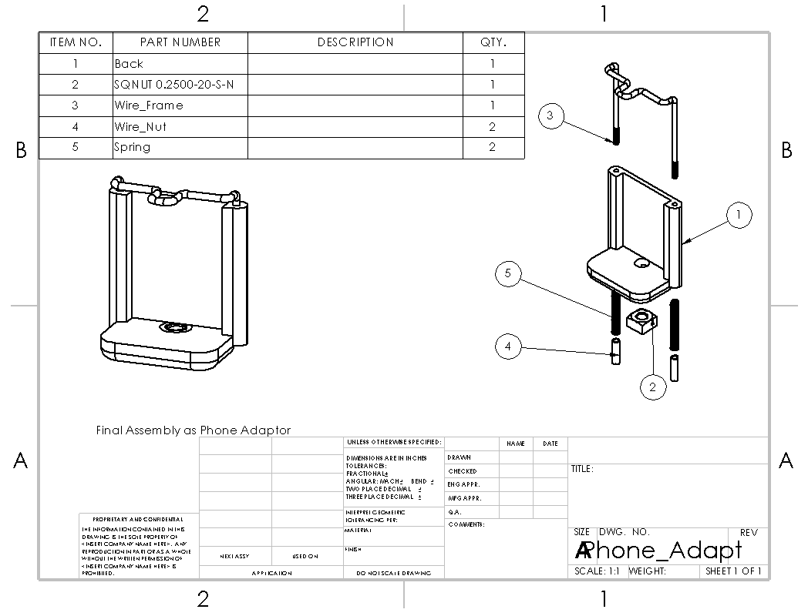

  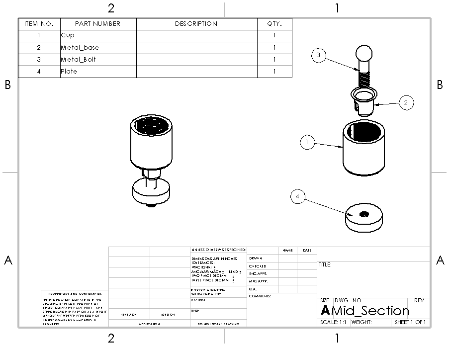
  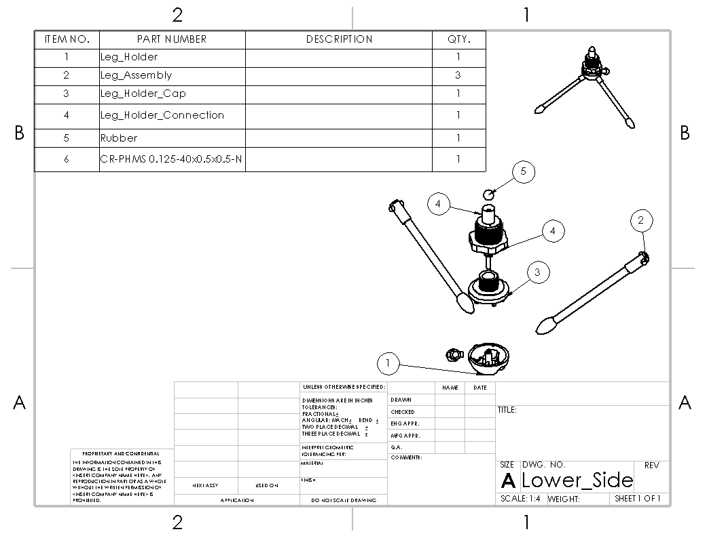

  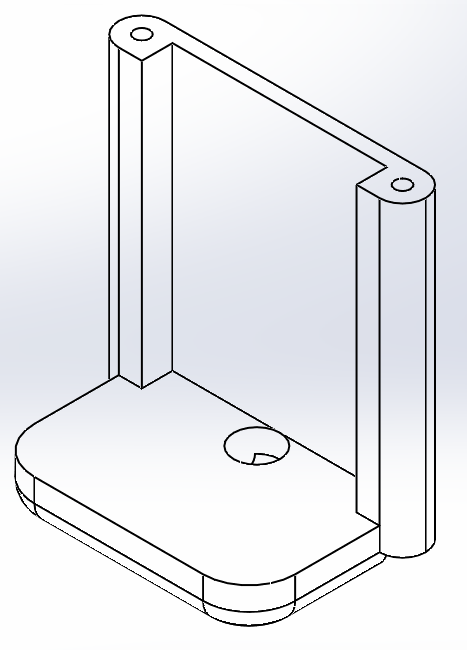
  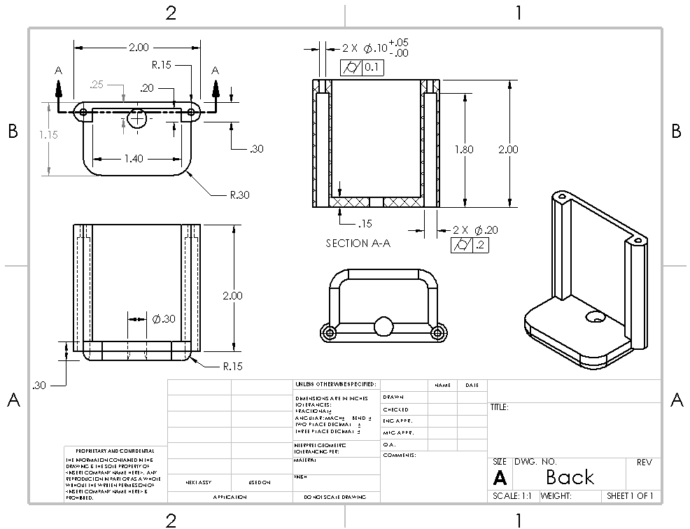

