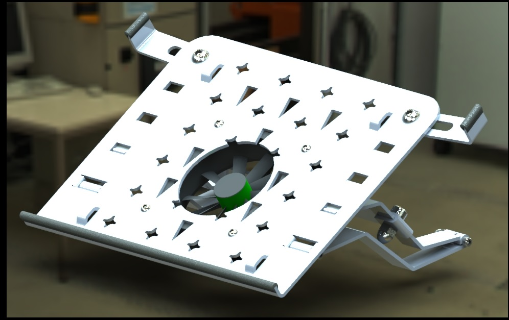
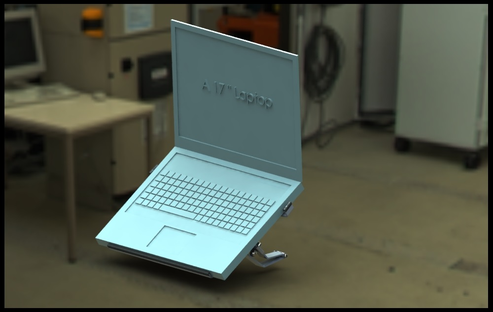

# Ehsan Tabatabaie | Engineering Portfolio
# Laptop Cooling Pad Design with adjustable size and angle

## 1. Project Overview
This file contains the CAD design for a Laptop Cooling Pad. The goal was to design a cooling pad using sheet metal.

## 2. Design Visuals
Below are the rendering of the model.

Here is asimple rendering of the assembly from a different angle. The design demontrating the fan and its wiring.
The device can be powered by external power or take it power from a USB port on the labptop.

| Another View of the pad  |   |
| :---: | :---: |
| |  |

